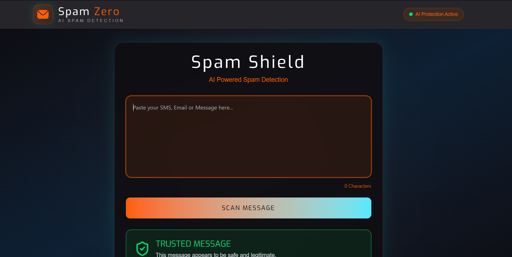

# Spam Classifier

A full-stack machine-learning web app that classifies a message as **Spam** or **Ham (trusted)**. Enter a message in the React interface and receive a prediction from the FastAPI model-serving API.

## Live application

- Frontend: [spam-classifier-amit.netlify.app](https://spam-classifier-amit.netlify.app)
- Backend API: [spam-classifier-tagz.onrender.com](https://spam-classifier-tagz.onrender.com)

## Screenshot



## Features

- Classifies submitted messages as spam or ham
- Responsive React user interface
- FastAPI prediction endpoint
- Scikit-learn model with TF-IDF text vectorization
- Netlify deployment with an `/api/*` proxy to the backend

## Tech stack

| Area | Technology |
| --- | --- |
| Frontend | React, Vite, Tailwind CSS, Axios |
| Backend | Python, FastAPI, Uvicorn |
| Machine learning | Scikit-learn, Joblib, NLP |
| Hosting | Netlify (frontend), Render (API) |

## How it works

1. A user enters a message in the web app.
2. The frontend posts it to `POST /predict`.
3. The API cleans the text, applies the saved TF-IDF vectorizer, and runs the trained classifier.
4. The UI displays the resulting `spam` or `ham` prediction.

## Run locally

### Requirements

- Python 3.10 or newer
- Node.js 20 or newer

### 1. Start the backend

```bash
python -m venv .venv
.\.venv\Scripts\Activate.ps1
pip install -r requirements.txt
uvicorn main:app --reload --port 8765
```

The API will be available at `http://127.0.0.1:8765`. Verify it at `GET /predict`.

### 2. Start the frontend

```bash
npm --prefix client install
Copy-Item client/.env.example client/.env
npm --prefix client run dev
```

Open the URL printed by Vite (normally `http://localhost:5173`). The local environment file points the frontend to `http://127.0.0.1:8765`.

## API

### `POST /predict`

Request body:

```json
{
  "message": "Congratulations! You have won a free prize."
}
```

Response:

```json
{
  "input": "Congratulations! You have won a free prize.",
  "clean_text": "congratulations you have won a free prize",
  "prediction": "spam"
}
```

## Deployment

Netlify builds the client with `npm --prefix client run build` and publishes `client/dist`. The [`netlify.toml`](netlify.toml) configuration redirects `/api/*` requests to the Render API.

For a production frontend build locally:

```bash
npm --prefix client run build
```

## Project structure

```text
.
├── client/             # React + Vite frontend
├── dataset/            # Training data
├── models/             # Saved classifier and TF-IDF vectorizer
├── main.py             # FastAPI application
├── requirements.txt    # Python dependencies
└── netlify.toml        # Netlify build and API proxy configuration
```
